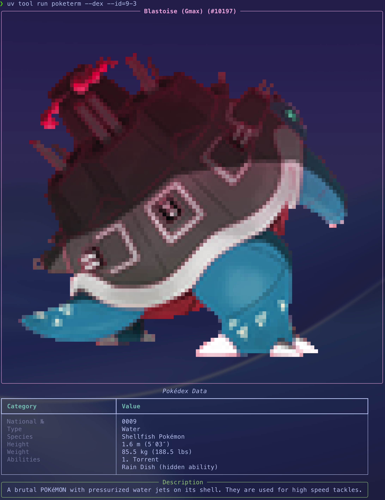

# Poketerm


**Python CLI Pokemon tool!**
Watch random pokemon image in terminal!

## Install
```bash
git clone https://github.com/sciencemj/poketerm.git
cd poketerm
uv tool install . --force
```

## Usage
```bash
poketerm [command] <flags>
# or, inside the cloned repo without installing
uv run poketerm [command] <flags>
```

### `show` (default command)
```bash
poketerm                      # random pokemon
poketerm --id 6 --dex         # Charizard with Pokédex info and type matchups
poketerm --id mr-mime         # by name
poketerm --id 6-2 --lang ko   # second form (Mega Charizard X), in Korean
poketerm --daily              # pokemon of the day
poketerm --gen 1              # random pokemon from generation 1
```
- `--id {num|name}`: pokemon number or name. Forms are separated by `-` (e.g. `003`, `003-2`, `mr-mime`, `charizard-mega-x`)
- `--daily`: the same pokemon all day, a new one tomorrow (handy in `.zshrc`/`.bashrc`)
- `--gen {num}`: pick the random/daily pokemon from one generation
- `--dex`: show Pokédex data, type matchups (weaknesses/resistances) and description
- `--size {num}`: width of the image in characters (auto by default)
- `--lang {en,ko}`: language for names and Pokédex text (default: `$POKETERM_LANG` or `en`)

### `quiz`
```bash
poketerm quiz --gen 1 --lang ko
```
"Who's that Pokémon?" — guess the pokemon from its silhouette. You get 3 tries, with a hint
after each wrong answer. Names in any language are accepted.

### `cache`
All data comes from [PokeAPI](https://pokeapi.co) and is cached on disk, so repeated runs are
fast and work offline.
```bash
poketerm cache          # show cache location and size
poketerm cache --clear  # delete cached data
```
Set `POKETERM_CACHE_DIR` to use a different cache directory.

## Development
```bash
uv sync
uv run pytest
uv run ruff check . && uv run ruff format --check .
```
